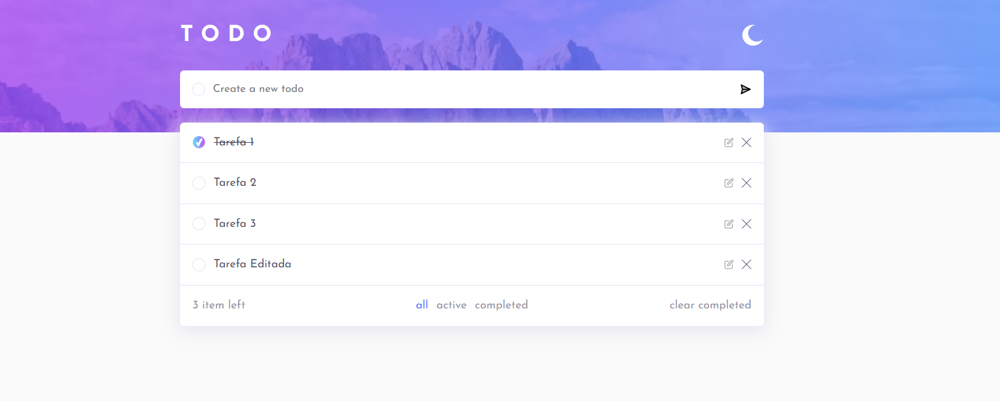
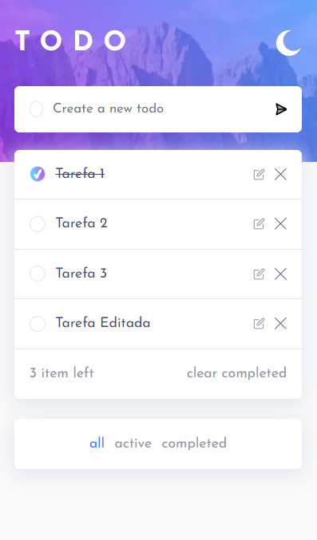

# Frontend Mentor TODO List

#### Previa Desktop


#### Previa Mobile


Frontend Mentor TODO List App, crie, atualize, complete e gerencie suas tarefas com essa ferramenta. Desafio feito usando como referencia o Design do Frontend mentor:

### Funcionalidades Implementadas;

- [X] Layout responsivo para todos os tipos de tela
- [X] Efeitos de hover para elementos ativos na pagina
- [X] Adicionar Novas Tarefas
- [X] Marcar tarefas como concluidas
- [X] Deletar tarefas da lista de tarefas
- [X] Filtrar tarefas Todas/Ativas/Tarefas Concluidas
- [X] Limpar todas as tarefas concluidas
- [X] Alternar entre tema claro e escuro
- [X] **Bonus**: Arrastar e Soltar tarefa para reordenar a lista ** está funcionando apenas no desktop.

### Ajustes e melhorias

O projeto ainda está em desenvolvimento e as próximas atualizações serão voltadas nas seguintes tarefas:

- [X] Validação no Form, criar tarefas com no minimo 5 caracteres.
- [X] Botão para editar tarefas.
- [X] Modal com validação antes de apagar itens.
- [] Adicionar Opção de inserir data para a tarefa.
- [] Atualizar lista - Apos Drag and Drop
- [] Corrigir função drag and drop no mobile
- [] Paginação exibir no maximo 07 tarefas por pagina.
- [] Lixeira para os Items Excluidos.

## 💻 Pré-requisitos

Antes de começar, verifique se você atendeu aos seguintes requisitos:

* Você instalou a versão mais recente de <nodejs 18v lts ou superior>

## 🚀 Instalando <Frontend_Mentor_TODO_List>

Para instalar o <Frontend_Mentor_TODO_List>, siga estas etapas:

Windows:
```
digitar no terminal para baixar o repositorio
git clone https://github.com/jumaelmartins/Frontend-Mentor-Todo-app-solution.git

ao abrir a pasta do repositorio utilizar o comando abaixo para instalar as dependencias
npm i

```

## ☕ Usando <Frontend_Mentor_TODO_List>

Para usar <Frontend_Mentor_TODO_List>, siga estas etapas:

Abrir em ambiente de densevolvimento:

com o projeto já instalado rodar o comando abaixo no terminal para inicializar o servidor local.

```
npm run dev
```

Abrir em produção

com o projeto já instalado rodar os comandos abaixo no terminal para inicializar o servidor local.

```
npm run build
```

após a build ser criada rodar o comando abaixo.

```
npm run preview
```


## Links

- Repositorio URL: [https://github.com/jumaelmartins/Frontend-Mentor-Todo-app-solution](https://github.com/jumaelmartins/Frontend-Mentor-Todo-app-solution)
- Site URL: [https://frontend-mentor-todo-app-solution-eight.vercel.app/](https://frontend-mentor-todo-app-solution-eight.vercel.app/)

### Ferramentas Utilizadas no Desenvolvimento:

- Html Semantico
- Flexbox
- Mobile-first
- [SASS](https://sass-lang.com/guide) - Pré Processador de CSS
- [Vite](https://vitejs.dev/) - Builder
- [JqueryUi](https://jqueryui.com/) - Biblioteca JS **Usei apenas para o Drag and Drop.

### O que Aprendi ao Desenvolver esse Projeto.

- CRUD
- Metodos de Array e Objetos
- Trabalhar com Local Storage
- BEM

## 📫 Contribuindo para <Frontend Mentor TODO List>

Para contribuir com <Frontend Mentor TODO List>, siga estas etapas:

1. Bifurque este repositório.
2. Crie um branch: `git checkout -b <nome_branch>`.
3. Faça suas alterações e confirme-as: `git commit -m '<mensagem_commit>'`
4. Envie para o branch original: `git push origin <nome_do_projeto> / <local>`
5. Crie a solicitação de pull.

Como alternativa, consulte a documentação do GitHub em [como criar uma solicitação pull](https://help.github.com/en/github/collaborating-with-issues-and-pull-requests/creating-a-pull-request).
